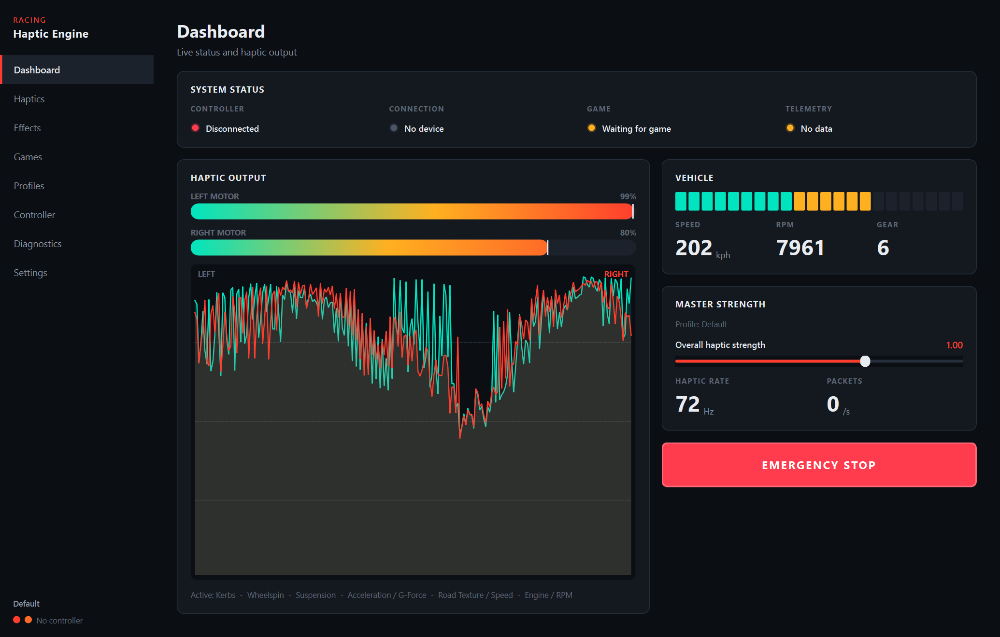

# Racing Haptic Engine

A Windows desktop application that turns racing-game telemetry into
realistic haptic feedback on an ordinary gamepad. Built and tuned for the
**Cosmic Byte Blitz Dual Mode** over its 2.4 GHz dongle, driven through
**direct XInput** — no vJoy, ViGEm, vXbox, pyxinput, virtual controllers or
firmware modifications.

F1 is the first supported game. The engine itself is game-agnostic.



---

## Quick start

```bash
python -m venv .venv
```

```bash
.venv\Scripts\pip install -r requirements.txt
```

```bash
.venv\Scripts\python -m app.main
```

Other entry points:

```bash
.venv\Scripts\python -m app.main --selftest
```

| Flag | Purpose |
| --- | --- |
| *(none)* | Launch the GUI |
| `--selftest` | Start every subsystem, print a status report, exit |
| `--diagnose` | Trace the telemetry pipeline stage by stage, then exit |
| `--headless` | Run the engine with no UI |
| `--verbose` | Debug logging |
| `--port N` | Override the telemetry UDP port |

### Telemetry not arriving?

```bash
python -m app.main --diagnose --diagnose-seconds 15
```

Close the app first — the probe needs the port exclusively. It reports which
stage the data stops at, and names the process holding the port if the bind
fails. The same figures are on the app's Diagnostics page while it runs.

The pipeline state is reported as a ladder rather than a single "connected"
flag, because each rung means a different problem:

| Stage | Meaning |
| --- | --- |
| `0/5 Error` | Port held by another process |
| `1/5 Waiting` | Listener not started |
| `2/5 UDP socket bound` | Listening, **zero packets** — game config issue |
| `3/5 Packets received` | Bytes arriving but not parsing — version mismatch |
| `4/5 Telemetry valid` | Frames parsed, then went quiet |
| `5/5 Telemetry live` | Working |

Most common causes of `2/5`: UDP Telemetry off in game, wrong IP/port, or
simply **sitting in the menus** — F1 only streams during an active session.
If the game is sending to a different port, a background scan of the usual
alternatives will detect it and say so on the Games page.

### Connecting F1

In game: **Settings → Telemetry Settings**

| Setting | Value |
| --- | --- |
| UDP Telemetry | On |
| UDP Broadcast Mode | Off |
| UDP IP Address | `127.0.0.1` (or this PC's IP if the game runs elsewhere) |
| UDP Port | `20777` (must match the Games page) |
| UDP Send Rate | 60 Hz |
| UDP Format | 2023, 2024 or 2025 |

Supported packet formats: **F1 22, 23, 24, 25**.

---

## The haptic philosophy

The Blitz has ordinary ERM (eccentric rotating mass) motors. They accept
amplitude only — there is no frequency channel — and they have real
mechanical limits. The engine is designed around three facts about that
hardware:

**1. The motor already smooths the signal.** An ERM rotor takes ~50 ms to
spin up and longer to coast down. That is a low-pass filter you get for
free. Adding a heavy software filter on top is the single fastest way to
make a haptic engine feel late and mushy, so **global smoothing is off by
default** and the motor model's slew limits are deliberately fast enough to
pass a transient essentially untouched.

**2. Smoothing must be per-effect, never global.** A gear shift needs a
sub-10 ms attack. Body float over a crest wants a few Hz of filtering. One
filter across the sum cannot serve both, and flattens them into the same
texture. Every effect therefore owns its own signal character — modulation
rate, waveform sharpness, envelope, and whether it filters at all.

**3. The bottom of the range is wasted.** Below roughly 0.15 drive the
rotor never breaks static friction. The motor model maps the usable range
onto real motion (`min_effective`) so subtle effects are actually felt
instead of vanishing into silence.

### Why the engine feels like an engine

The RPM effect is the least-filtered thing in the codebase. Modulation rate
scales with revs on an **exponent above 1**, so the *rate of change itself*
grows toward the redline — 7000 → 8000 → 9000 rpm is unmistakable rather
than a uniform buzz. Measured across the band:

| Engine speed | Modulation rate | Character |
| --- | --- | --- |
| Idle / low | ~7 Hz | Slow, countable, distinct pulses |
| Mid | ~18 Hz | Pulses merging into a rhythm |
| High | ~26–32 Hz | Aggressive continuous buzz that still has texture |
| Rev limiter | 20 Hz hard gate | A stuttering on/off — categorically different, not just "more" |

Modulation *depth* narrows as revs rise (deep pulses low down, a tighter
band on a high base up top), which is what makes the top end read as urgent
rather than merely loud.

### Per-effect character

| Effect | Signal design |
| --- | --- |
| **Engine / RPM** | Minimal filtering; rate and level both climb, rate accelerates near redline |
| **Gear shift** | Single-tick attack, ~100 ms total. An impact, not a vibration |
| **Kerbs** | Rib-crossing rate derived from road speed; hard edges; per-wheel left/right |
| **ABS / wheel lock** | Hard square gate at ~16 Hz with a few percent rate jitter, so it feels like hydraulics rather than a tone |
| **Wheelspin** | Rate climbs steeply with slip, noise folded in so it never settles — traction loss should feel nervous |
| **Collision** | Priority 100, dominance 1.0 — briefly owns both motors. Instant attack, severity-scaled decay, then silence |
| **Surface** | Noise-driven, not periodic. Gravel uses sample-and-hold (jagged), grass interpolated (softer) |
| **Suspension** | The one effect that genuinely low-passes (9 Hz) — body motion is a few Hz and would otherwise fizz |
| **Braking** | Responsive to the pedal, held back so it never masks ABS |
| **Acceleration** | Reads measured g, not throttle position; lateral load routed to the outside motor |
| **Road texture / speed** | The quietest bed; builds with speed |

### How simultaneous effects are combined

Naive summing pins everything at 1.0 and every event feels identical.
Naive `max()` means only the loudest effect is ever felt. The mixer does
neither: effects are applied strongest-priority-first and each consumes
*headroom* proportional to its own amplitude and its `dominance`.

- A full-strength collision (dominance 1.0) leaves no headroom — it owns the controller.
- The engine bed (dominance 0.22) barely ducks anything, so kerbs and shifts punch straight through it.
- The result is soft-limited above 0.85 rather than clipped, so contrast survives.

---

## Architecture

The haptic engine never imports anything game-specific. Adapters translate
their game's packets into a normalized `TelemetryFrame`; effects consume
only that.

```
app/
  main.py                    entry point (GUI / headless / selftest)
  core/
    application.py             composition root and lifecycle
    models.py                  TelemetryFrame - the game-agnostic contract
    events.py                  thread-safe event bus
    logging.py                 logging + ring buffer for Diagnostics
    paths.py                   %APPDATA% locations
  controller/
    base.py                    ControllerBackend ABC (+ NullController)
    xinput.py                  ctypes XInput bindings
    blitz.py                   XInput controller implementation
    device_manager.py          hot-plug detection, disconnect cutoff
  haptics/
    signal.py                  oscillators, noise, envelopes, filters
    motor.py                   ERM physical model
    mixer.py                   priority ducking + soft limiter
    engine.py                  the 120 Hz loop and safety watchdogs
    scheduler.py               manual/one-shot cues
    patterns.py                Test Lab patterns
    effects/                   11 effects, each with its own character
  games/
    base.py                    GameAdapter ABC
    registry.py                available adapters
    f1/                        packets, parser, UDP listener, adapter
    forza/                     placeholder - see below
  profiles/                    schema, defaults, CRUD, import/export
  config/settings.py           application settings
  diagnostics/metrics.py       health collection
  ui/                          Qt theme, widgets, 8 pages
tests/                         254 tests
```

### Threading

Four independent threads, so nothing can stall motor output:

| Thread | Rate | Role |
| --- | --- | --- |
| Haptic engine | 120 Hz | Effects → mixer → motor model → XInput |
| Telemetry | packet-driven | UDP receive and parse |
| Device manager | 1 Hz | Hot-plug detection |
| Qt UI | 30 Hz | Polls an immutable snapshot — never touches the loop |

Measured: **~116 Hz sustained** against a 120 Hz target with the dashboard
visible and telemetry at 60 Hz.

### Adding a game

1. Subclass `GameAdapter`, translate the game's telemetry into `TelemetryFrame`.
2. Register it in `games/registry.py`.

Nothing in `app/haptics/` changes. Every existing effect works the moment
frames start arriving. `games/forza/adapter.py` documents exactly what a
Forza implementation would involve — it reports itself as unsupported and
produces no telemetry rather than faking a connection.

---

## Safety

The one guarantee: **the motors stop.**

| Mechanism | Trigger |
| --- | --- |
| Emergency stop | User (dashboard, Controller page, or tray menu); latches until cleared |
| Stale telemetry cutoff | Data older than the timeout — effects fall silent on their own |
| Controller disconnect | `DeviceManager` event cuts output immediately |
| Loop watchdog | Separate thread force-stops the hardware if the loop stalls with motors live |
| Exception safety | A failing tick silences the motors and the loop survives |
| Shutdown | `finally` in `main()`; idempotent; always ends silent |
| Output limit | Hard ceiling applied last, after everything else |
| Test Lab cap | Manual patterns are duration-limited by the scheduler |

Stale telemetry is the important one in practice: if the game closes, alt-tabs,
or the network drops, frozen data can never keep the motors running.

---

## Profiles

Five ship with the app: **Default**, **F1 Realistic**, **F1 Strong**,
**F1 Subtle**, **Custom**. Default is tuned to feel right immediately — no
tuning required.

Stored as JSON under `%APPDATA%\RacingHapticEngine\profiles`. Writes are
atomic. Loading is deliberately tolerant: unknown keys are ignored, missing
keys default, out-of-range values are clamped, and a corrupt file is skipped
rather than being fatal. Built-in profiles cannot be deleted — only reset —
so a known-good configuration is always one click away.

---

## Tests

```bash
.venv\Scripts\python -m pytest
```

254 tests. Hardware-dependent tests skip automatically when no controller
is attached, and become active when one is.

Coverage includes: XInput wrapper and controller abstraction, motor model
(dead zone, curve, slew, NaN rejection), signal primitives, all 11 effects
(asserting *character* — that engine rate rises with revs, that kerbs return
to silence between ribs, that gravel is irregular rather than periodic),
mixer priority/ducking/limiting, F1 packet parsing against byte-exact
spec-built packets, malformed and truncated packet handling, collision
derivation (including that hard braking is *not* read as a collision),
telemetry timeout, emergency stop, watchdog, profiles and settings
persistence, and full-engine integration with several effects live at once.

---

## Verification status

| Verified | How |
| --- | --- |
| XInput rumble on real hardware | Physical Blitz on slot 0 — left/right/both pulses and ramps confirmed by the user |
| UDP telemetry pipeline | Real socket, spec-built F1 23 packets, 4 packet types → one normalized frame, 0 rejections |
| Engine loop under UI load | ~116 Hz sustained against a 120 Hz target |
| All 8 UI pages | Constructed, refreshed and screenshotted with live synthetic telemetry |
| Application startup/shutdown | `--selftest` passes; shutdown always ends with motors silent |

**Not yet verified:** end-to-end feel with F1 actually running. The
telemetry path is tested against spec-built packets rather than a live
game, and the per-effect tuning values are engineering judgement — they will
benefit from a real session on track.

---

## Requirements

- Windows (XInput)
- Python 3.11+ (developed on 3.14)
- PySide6

The app degrades safely without hardware: if XInput is unavailable or no
controller is attached, it still runs, reports the situation honestly on the
Dashboard and Diagnostics pages, and never pretends to be connected.
